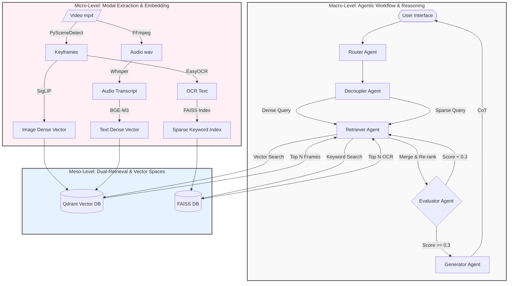

# MULTIMODAL VIDEO SEARCH & QA SYSTEM (Multimodal Video RAG)

This project is a **Retrieval-Augmented Generation (RAG) system specifically designed for Video**. It allows users to ask questions via text or image to search for specific moments within videos and receive natural, highly accurate answers.

The system is highly optimized to run locally on **Apple Silicon architecture (M4, 16GB RAM)**, leveraging the reasoning capabilities of the Claude 3.5 Sonnet LLM (via API).

---

## HIGH-LEVEL ARCHITECTURE

This project surpasses traditional RAG systems by implementing three core architectural concepts:

### 1. SEN (Super Encoding Network)
In conventional multimodal RAG, images and text are separated into two independent vector spaces (e.g., CLIP for images, BERT for text). This creates a **"Semantic Gap"** when trying to cross-match between the two spaces.
* **SEN Concept:** A network architecture that projects all modalities (Image, Audio, Text) into a single, Unified Vector Space.
* **Project Application:** Although hardware limitations currently prevent running heavy SEN models directly (like VALOR or ImageBind), this project simulates the SEN mechanism using a **Dense Dual-Vector (SigLIP + E5)** running in parallel within the same Qdrant Payload. As a result, a video Frame is tightly coupled with its Narrative Context, forming a unified "Knowledge Snippet".

### 2. Dual-Retriever Mechanism
Dense Vectors (like SigLIP) are excellent at finding "semantically similar" concepts (e.g., typing "car" might retrieve a "truck"). However, Dense Vectors are notoriously poor at **Exact Matches**, especially for proper nouns, numbers, or text on signs.
* **Dual-Retriever Mechanism:** We solve this by running two retrieval streams in parallel:
  - **Dense Retrieval (Qdrant):** Captures the main idea, context, and visual shapes (using SigLIP/E5).
  - **Sparse/Exact Retrieval (FAISS/BM25):** Captures absolute exact keywords (using OCR text).
* In `retriever_agent.py`, the system fetches results from both streams and performs **Re-ranking** via a scoring merge. The final result is a perfect intersection of "correct meaning" and "exact keywords".

### 3. Video-RAG (Retrieval-Augmented Generation for Video)
Most current AI video systems simply feed the entire audio transcript (subtitles) into the LLM. If the video has no spoken words, the system goes blind.
* **Video-RAG Architecture:** Instead of relying solely on audio, the system directly scans visual streams:
  - **OCR (Optical Character Recognition):** Reads text on the screen (Signs, license plates, hardcoded subtitles).
  - **DET (Object Detection):** Fragments and identifies static objects.
* This "invisible" visual information is decoded into text and pushed into an Auxiliary Database. During a query, the AI (Decoupler Agent) intentionally searches for this information, allowing the system to answer extremely difficult questions that even a human skimming the video might miss (e.g., "What is the phone number written on the wall at minute 2?").

---

## MICRO-TO-MACRO INTEGRATION

Similar to deep learning systems described in academic papers, this project does not operate as a monolith. It is a sophisticated combination of small modules. Below is the workflow diagram illustrating the integration from Micro to Macro:



### Layer Analysis:
1. **Micro-Level (Feature Extraction):** These are the lowest-level hardware "workers". The raw video is chopped into independent streams: Image, Audio, Text. Algorithms (SigLIP, BGE-M3, Whisper, EasyOCR) compress these physical streams into mathematical numbers (Vectors/Matrices).
2. **Meso-Level (Storage & Retrieval):** The intersection of knowledge. It uses the **Dual-Retriever** mechanism. Instead of only performing fuzzy semantic searches (Dense Retrieval via Qdrant), it incorporates hard keyword searches (Sparse/Exact Retrieval via FAISS). The two result streams are Merged to create the most optimal dataset.
3. **Macro-Level (LLM Reasoning):** Where the AI (Claude) truly shines. The Agents operate on a State Machine model. They don't blindly answer immediately; they know how to **Decouple the question**, **Evaluate the documents**, and most importantly, perform logical reasoning (**Chain-of-Thought**) before delivering the final result to the user.

---

## 1. CORE TECHNOLOGIES, ALGORITHMS & TECHNIQUES

The system utilizes **Hybrid Search**, combining Dense Retrieval (Vector space) and Sparse/Exact Retrieval (Exact text search) to ensure no video semantics (Images, Dialogues, Handwriting/Signs) are missed.

### A. Computer Vision
* **PySceneDetect (Adaptive Scene Detection):** Instead of blindly cutting frames by time (e.g., 1 fps) which floods RAM, this algorithm calculates pixel/color changes (Thresholding & Histogram) between consecutive frames to detect "cuts". Only 1 representative frame is taken per scene (or 1 frame every 5s for long scenes), compressing video data immensely without losing content.
* **EasyOCR:** A deep learning network (CNN + RNN) specialized in "reading screen text" (hardcoded subtitles, signs, text in video). This data is crucial for identification queries (e.g., "What is the license plate of the truck?").
* **YOLO (Ultralytics Object Detection):** A real-time bounding box network used to localize and classify physical entities in the frame. By counting and mapping spatial relationships of objects, it provides structured metadata that complements dense vectors.
* **SigLIP (`google/siglip-so400m-patch14-384`):** Google's image embedding algorithm, an upgrade from CLIP. It converts an image into a mathematical vector (1152 dimensions) such that images with similar semantics are positioned closely in vector space.

### B. Audio Processing
* **FFmpeg:** Extracts the audio track from the original `.mp4` file into raw format (PCM WAV) to prepare for transcription.
* **OpenAI Whisper (Base Model):** Automatic Speech Recognition (ASR). Transcribes spoken words into text, divided by timestamps to match the image frames.

### C. Text Embedding
* **BGE-M3 (`intfloat/multilingual-e5-large`):** A powerful multilingual text embedding algorithm (via `fastembed`). Converts user queries and video transcripts into vectors (1024 dimensions) for Cosine Similarity search.

### D. Databases
* **Qdrant (Vector Database):** A specialized DB for storing Dense Vectors (SigLIP, E5). Supports high-speed approximate search (HNSW Algorithm).
* **FAISS (Facebook AI Similarity Search):** A Meta library used to create a local Auxiliary Database. Used to index and exactly search for vocabulary phrases (OCR, Transcripts) that Vector Databases sometimes misinterpret. This architecture is called **Video-RAG**.

### E. Agentic Workflow
* **LangGraph:** A framework for managing State Machine workflows. All reasoning processes (Ask -> Think -> Retrieve -> Evaluate -> Generate) are designed as graph Nodes.
* **Claude 3.5 Sonnet (LLM):** Acts as the central Brain for 3 tasks: Decoupling complex questions, Evaluating document quality, and Generating answers with Chain-of-Thought (CoT) reasoning.

---

## 2. PROJECT STRUCTURE & FILE MEANINGS

```text
multimodalRAG_claudecore/
├── app.py                       # Streamlit UI entry point. Where users input queries.
├── run_app.sh / run_encoder.sh  # Bash scripts for quick project startup.
├── docker-compose.yml           # Docker config to launch Qdrant and Redis.
│
├── docs/                        # Deep-dive theory documentation (SEN, RAG Pipeline).
├── faiss_dbs/                   # (Auto-generated) Contains .faiss and .json files for Video-RAG (OCR storage).
│
└── src/
    ├── ingestion/               # PHASE 1: OFFLINE ENCODER - Runs once for new videos.
    │   ├── offline_encoder.py   # Main orchestrator: scans videos, calls frame extraction, OCR, pushes to Qdrant.
    │   ├── video_processor.py   # Contains PySceneDetect (cutting) and Whisper (transcription) logic.
    │   ├── auxiliary_builder.py # Contains EasyOCR logic, reads text in images, saves to internal FAISS DB.
    │   └── embedder.py          # Contains SigLIP and E5-large. Converts image/text to numbers, pushes to Qdrant.
    │
    └── agents/                  # PHASE 2: ONLINE RAG - Runs every time a user chats.
        ├── state.py             # Defines data structure moving through the system (LangGraph Memory).
        ├── graph.py             # Connects Agent files below into a closed workflow.
        ├── router_agent.py      # LLM categorizes queries (Search? QA? Temporal logic?).
        ├── query_decoupler.py   # LLM splits long queries into "Vision Branch" and "Text/OCR Branch".
        ├── retriever_agent.py   # Search Engine. Uses decoupled queries to probe Qdrant and FAISS for Top 5 frames.
        ├── evaluator_agent.py   # The Inspector. Grades if the Top 5 frames answer the query (Score > 0.3).
        └── generator_agent.py   # LLM synthesizes the frames, "thinks" (<think>), and writes final answer.
```

---

## 3. DETAILED WORKFLOW IN ACTION

### PHASE 1: INGESTION FLOW - `run_encoder.sh`
*For Server/Admins to run when new videos are downloaded.*

1. `offline_encoder.py` scans the `data/raw_videos/` directory.
2. Passes the `.mp4` file to `video_processor.py`.
3. `video_processor.py` extracts the audio and uses **Whisper** to transcribe it to text (saved with timestamps).
4. `video_processor.py` then uses **PySceneDetect** to detect pixel changes and extract representative Keyframes.
5. For each Frame, it checks the timestamp and slices the matching Whisper text -> Creating a *Narrative Context*.
6. Returns the Frame array to `offline_encoder.py`.
7. `offline_encoder.py` passes this array to `auxiliary_builder.py`. Here, **EasyOCR** scans each image, reads all text, converts it to vectors, and saves them as `.faiss` files on the hard drive (Video-RAG architecture).
8. Finally, `offline_encoder.py` pushes the Frame array to `embedder.py`. Images pass through **SigLIP**, Narrative context passes through **E5-Large** to become Vectors, which are then injected straight into **Qdrant**.
*(This flow costs $0 in API fees, running 100% locally).*

### PHASE 2: INFERENCE FLOW - `run_app.sh`
*Runs continuously every time a user clicks Send.*

1. User inputs: *"When does the truck with the word 'Vinamilk' appear?"*
2. **Router Agent:** Detects the temporal aspect and tags the query as `TEXTUAL_KIS` (Keyframe Search).
3. **Decoupler Agent:** Claude reasons and splits the query in two:
   - *Vision Query:* "The truck"
   - *Video-RAG Query (OCR):* "Vinamilk"
4. **Retriever Agent:** 
   - Converts "The truck" into a vector, queries Qdrant to find Frames containing trucks.
   - Queries the hard drive (FAISS) with "Vinamilk" to find Frames where EasyOCR previously read that word.
   - Merges the two result sets, calculating cumulative scores. A frame with both a truck image and the word Vinamilk will rise to Top 1.
5. **Evaluator Agent:** Checks the Top 1 score (e.g., 0.82 > 0.3 threshold). Allows PASS (Proceed).
6. **Generator Agent:** Claude receives all info about the Top 1 Frame (Image path, timestamp, narrative context, OCR text). Claude opens a `<think>` tag to analyze logic, then answers: *"The Vinamilk truck appears at 01:24, while driving on the highway."*
7. Returns the result + Image display to the Streamlit UI. Workflow ends.
