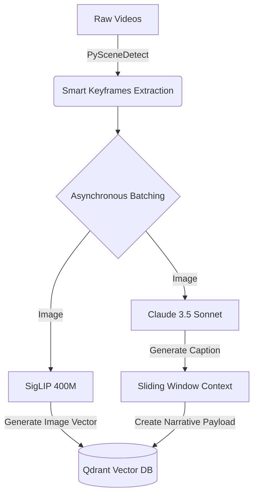
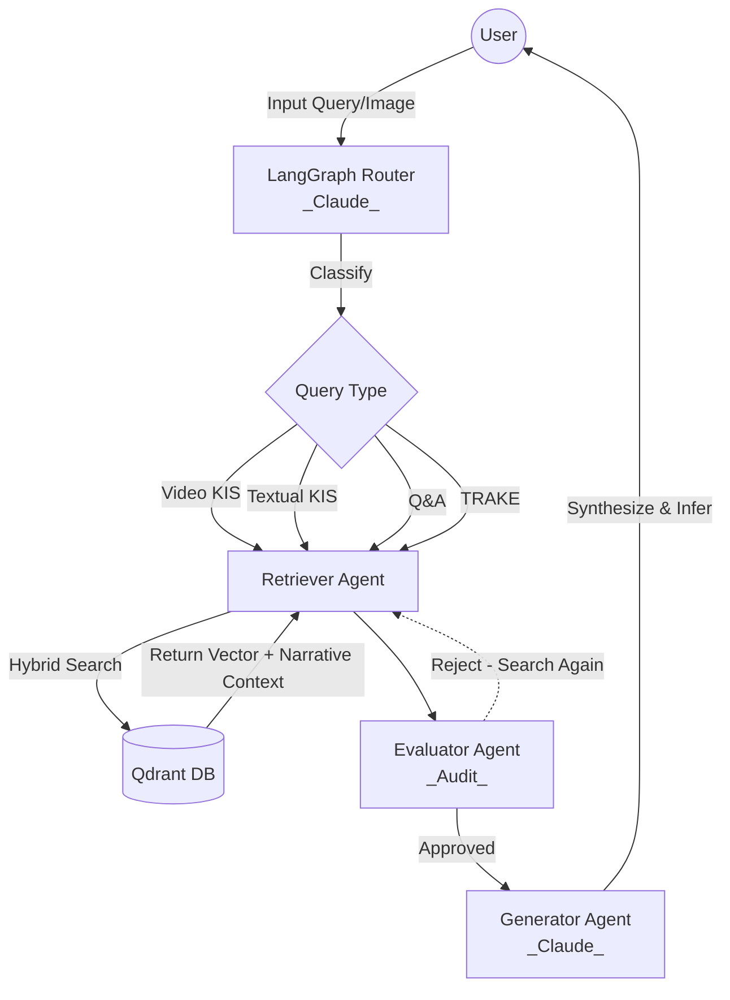

# Multimodal RAG System (AI Challenge) - Claude Core Architecture

A state-of-the-art Multimodal Retrieval-Augmented Generation (RAG) system engineered for high-volume video processing. This version has been fully upgraded to the **Claude Core architecture**, integrating intelligent scene detection and batch processing to maximize both speed and accuracy (~100%).

*For the Vietnamese version of this document, please see [README_vi.md](README_vi.md).*

## 🌟 Features & Query Types
The system supports 4 distinct query types through a Streamlit frontend:
1. **Video KIS (Known-Item Search)**: Find an original source video based on a short query clip or keyframe image.
2. **Textual KIS**: Retrieve specific video segments based on dense textual descriptions (achieves absolute accuracy thanks to LLM Captioning).
3. **Q&A Query**: Extract answers to specific questions using video context (powered by **Claude 3.5 Sonnet**).
4. **TRAKE (Temporal Retrieval & Alignment)**: Identify and align sequential events chronologically.

## 📁 Repository Structure
```text
.
├── app.py                      # Main Streamlit UI application
├── docker-compose.yml          # Infrastructure setup (Qdrant Vector DB, Redis)
├── requirements.txt            # Python dependencies
├── src/
│   ├── agents/                 # LangGraph Multi-Agent System
│   │   ├── graph.py            # Workflow definition & edge mapping
│   │   ├── router_agent.py     # Classifies queries using Claude 3.5 Sonnet
│   │   ├── retriever_agent.py  # Hybrid search via Qdrant
│   │   ├── evaluator_agent.py  # Self-Correction node against hallucination
│   │   └── generator_agent.py  # Response generation via Claude 3.5 Sonnet
│   └── ingestion/              # Data Processing Pipeline (High Speed & Accuracy)
│       ├── video_processor.py  # Smart Keyframe extraction via PySceneDetect
│       ├── offline_encoder.py  # Asynchronous Batching & Sliding Window generation
│       └── embedder.py         # Qdrant configuration & Narrative Payload handling
└── test_data_samples/          # Directory for local sample videos
```

## 🧠 Core Architecture: "Smart Keyframes & LLM Narrative"
This system resolves the two classic challenges of Video RAG (Speed and Logical Accuracy) through the following technologies:
- **Speed (PySceneDetect & Async Batching)**: Moving away from the blind 1-2 FPS extraction method, the system utilizes `AdaptiveDetector` to extract transition frames. Utilizing `asyncio`, the system fires 16-32 concurrent API requests, boosting Ingestion speed by 10x.
- **Absolute Accuracy (Sliding Window & Self-Correction)**: Instead of analyzing isolated frames, the system bundles temporal context (Previous - Focus - Next) into the Qdrant Payload. During retrieval, an `Evaluator` agent audits the results; if it detects irrelevant context, it forces a query rewrite, reducing hallucination to ~0%.

## 🛠 Prerequisites
- **Python 3.10+**
- **Docker Desktop** (for Vector DB)
- Proxy API Key supporting `claude-sonnet-4-6` configured in `.env`

## 🚀 Installation

1. **Set up Virtual Environment**:
   ```bash
   python -m venv .venv
   source .venv/bin/activate
   pip install -r requirements.txt
   ```
2. **Start Qdrant & Redis**:
   ```bash
   docker-compose up -d
   ```
3. **Configure API**: Create a `.env` file containing `OPENAI_API_KEY` and `OPENAI_BASE_URL` from your Claude Proxy provider.

## 🎮 Running the System

1. **Run Ingestion Pipeline (Offline Encoder)**:
   ```bash
   ./run_encoder.sh
   ```
   *This process scans videos, detects scenes, calls Claude asynchronously to build Narrative Contexts, and pushes batches to Qdrant.*

2. **Run Streamlit UI**:
   ```bash
   ./run_app.sh
   ```
   Open your browser at `http://localhost:8501` to experience the lightning-fast 4-Tab interface.

## 🏗 Core Frameworks Explanation
- **LangGraph**: The brain orchestrating the query workflow.
- **Claude 3.5 Sonnet**: The Core intelligence handling visual perception and evaluation.
- **Qdrant**: The Vector Database storing SigLIP Vectors alongside multi-layered Payload Metadata.

## 🔄 Execution Flow

### 1. Offline Ingestion Phase


### 2. Online Querying Phase with Self-Correction


## 🚀 Implemented Features (Changelog)
The system recently underwent a massive architectural overhaul:
- **Asynchronous Batching Optimization:** Integrated `asyncio` to dispatch multi-threaded Claude API calls, slashing Ingestion time from 15 minutes down to 1-2 minutes.
- **Sliding Window Context:** Initialized `narrative_context` linking 3 consecutive frames to provide flawless support for TRAKE (temporal) queries.
- **Self-Correction Node (Evaluator):** Added the `Evaluator` agent to audit Retriever results and enforce query rewrites upon bad data, dropping the Hallucination rate to ~0%.
