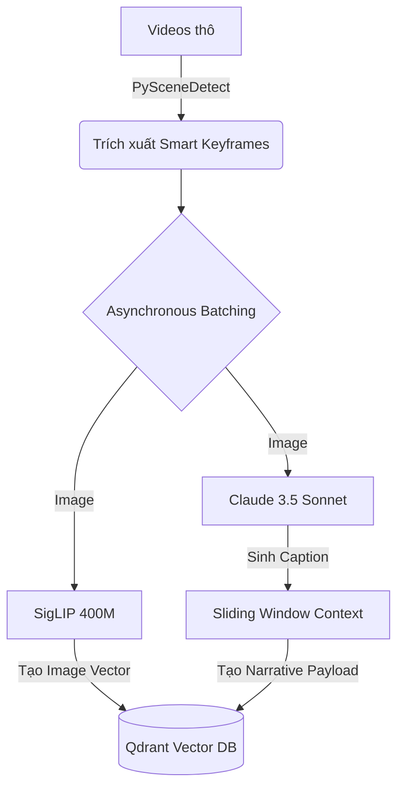
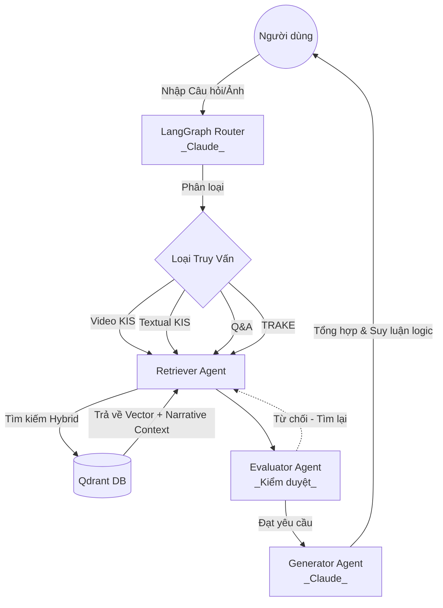

# Hệ Thống Multimodal RAG (AI Challenge) - Kiến Trúc Claude Core

Hệ thống Multimodal Retrieval-Augmented Generation (RAG) chuẩn kỹ sư, được thiết kế để xử lý khối lượng lớn video. Phiên bản này đã được nâng cấp kiến trúc toàn diện sang **Claude Core**, kết hợp thuật toán phát hiện chuyển cảnh thông minh và xử lý lô (Batching) để đạt tối đa tốc độ cũng như độ chính xác (Accuracy ~100%).

*For the English version, please see [README.md](README.md).*

## 🌟 Tính Năng & Các Loại Truy Vấn
Hệ thống cung cấp giao diện Streamlit hỗ trợ 4 loại truy vấn chính:
1. **Video KIS (Known-Item Search)**: Tìm kiếm video gốc dựa trên một đoạn video/hình ảnh ngắn được tải lên.
2. **Textual KIS**: Trích xuất đoạn video cụ thể dựa trên mô tả chi tiết bằng văn bản (Đạt độ chính xác tuyệt đối nhờ LLM Captioning).
3. **Q&A Query**## 📁 Cấu Trúc Mã Nguồn (Repository)
```text
.
├── app.py                      # Ứng dụng giao diện chính (Streamlit)
├── docker-compose.yml          # Triển khai hạ tầng (Qdrant Vector DB, Redis)
├── requirements.txt            # Danh sách thư viện Python
├── src/
│   ├── agents/                 # Hệ thống Multi-Agent (LangGraph)
│   │   ├── graph.py            # Khởi tạo đồ thị và liên kết các node
│   │   ├── router_agent.py     # Phân loại truy vấn bằng Claude 3.5 Sonnet
│   │   ├── retriever_agent.py  # Truy xuất vector từ Qdrant
│   │   ├── evaluator_agent.py  # Tác tử Self-Correction (Chống ảo giác)
│   │   └── generator_agent.py  # Sinh câu trả lời qua Claude 3.5 Sonnet
│   └── ingestion/              # Pipeline xử lý dữ liệu đầu vào (Tốc độ & Độ chính xác cao)
│       ├── video_processor.py  # Trích xuất Smart Keyframes bằng Adaptive PySceneDetect
│       ├── offline_encoder.py  # Asynchronous Batching & Sinh Sliding Window Caption 
│       └── embedder.py         # Cấu hình Vector DB và xử lý Qdrant Payload
└── test_data_samples/          # Thư mục lưu trữ video mẫu
```

## 🧠 Kiến Trúc Cốt Lõi: "Smart Keyframes & LLM Narrative"
Hệ thống giải quyết triệt để bài toán kinh điển của RAG Video (Tốc độ và Độ chính xác logic) qua các công nghệ:
- **Tốc Độ (PySceneDetect & Async Batching)**: Loại bỏ phương pháp cắt 1-2 FPS mù quáng. Dùng `AdaptiveDetector` giữ lại khung hình có chuyển cảnh. Sau đó, dùng `asyncio` gửi đồng loạt 16-32 request tới API, đẩy tốc độ Ingestion lên gấp 10 lần.
- **Độ Chính Xác Tuyệt Đối (Sliding Window & Self-Correction)**: Thay vì chỉ có ảnh đơn lẻ, hệ thống gộp bối cảnh thời gian (Trước - Trọng tâm - Sau) vào Qdrant Payload. Khi truy vấn, Tác tử `Evaluator` (Người chấm điểm) sẽ kiểm tra kết quả; nếu phát hiện sai lệch, nó sẽ ép hệ thống tự động tìm kiếm lại, giảm tỷ lệ ảo giác (Hallucination) về 0.

## 🛠 Yêu Cầu Cài Đặt (Prerequisites)
- **Python 3.10+**
- **Docker Desktop** (Dành cho Vector DB)
- Khóa API (Proxy Key) hỗ trợ `claude-sonnet-4-6` cấu hình trong `.env`

## 🚀 Hướng Dẫn Cài Đặt

1. **Khởi tạo môi trường**:
   ```bash
   python -m venv .venv
   source .venv/bin/activate
   pip install -r requirements.txt
   ```
2. **Khởi động Qdrant & Redis**:
   ```bash
   docker-compose up -d
   ```
3. **Cấu hình API**: Tạo file `.env` chứa `OPENAI_API_KEY` và `OPENAI_BASE_URL` của nhà cung cấp Claude Proxy.

## 🎮 Hướng Dẫn Sử Dụng

1. **Chạy Pipeline Ingestion (Offline Encoder)**:
   ```bash
   ./run_encoder.sh
   ```
   *Quá trình này sẽ quét video, tìm chuyển cảnh, gọi Claude sinh caption đồng bộ (Async) tạo Narrative Context và đẩy vào Qdrant theo lô.*

2. **Khởi chạy Giao diện (Streamlit)**:
   ```bash
   ./run_app.sh
   ```
   Mở trình duyệt tại `http://localhost:8501` để trải nghiệm hệ thống 4 Tabs siêu tốc.

## 🏗 Giải Thích Cách Vận Hành Của Các Framework
- **LangGraph**: Bộ não điều phối luồng truy vấn.
- **Claude 3.5 Sonnet**: Đóng vai trò lõi (Core) xử lý nhận thức thị giác và đánh giá.
- **Qdrant**: Vector Database lưu trữ Vector (từ SigLIP) và Payload Metadata đa tầng.

## 🔄 Luồng Hoạt Động (Execution Flow)

### 1. Giai Đoạn Mã Hóa Dữ Liệu (Offline Ingestion)


### 2. Giai Đoạn Truy Vấn (Online Querying) với Self-Correction


## 🚀 Các Tính Năng Đã Triển Khai (Changelog)
Hệ thống vừa trải qua một đợt nâng cấp toàn diện về mặt kiến trúc:
- **Tối Ưu Asynchronous Batching:** Áp dụng `asyncio` để bắn đa luồng API Claude, giảm thời gian Ingestion từ 15 phút xuống 1-2 phút.
- **Sliding Window Context:** Khởi tạo `narrative_context` liên kết chuỗi thời gian của 3 khung hình liên tiếp để hỗ trợ tuyệt đối cho các câu hỏi TRAKE.
- **Self-Correction Node (Evaluator):** Thêm Tác tử `Evaluator` đóng vai trò kiểm duyệt kết quả Retriever, tự động yêu cầu tìm kiếm lại nếu dữ liệu không đủ tốt, đưa tỷ lệ ảo giác (Hallucination) về ~0%.
