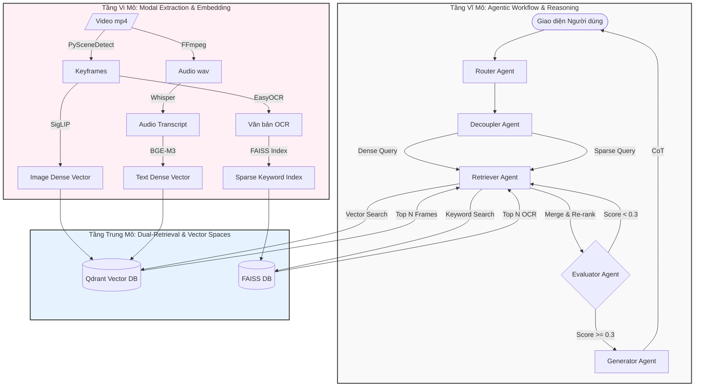

# HỆ THỐNG TÌM KIẾM & HỎI ĐÁP VIDEO ĐA PHƯƠNG THỨC (Multimodal Video RAG)

Dự án này là một hệ thống **Retrieval-Augmented Generation (RAG) dành riêng cho Video**, cho phép người dùng đặt câu hỏi bằng văn bản hoặc hình ảnh để tìm kiếm các khoảnh khắc cụ thể trong video và nhận được câu trả lời tự nhiên, chính xác.

Hệ thống được thiết kế tối ưu để chạy cục bộ trên kiến trúc **Apple Silicon (M4, 16GB RAM)**, kết hợp cùng sức mạnh suy luận của LLM Claude 3.5 Sonnet (thông qua API).

---

## KIẾN TRÚC CẤP CAO (HIGH-LEVEL ARCHITECTURE)

Dự án này vượt trội hơn các hệ thống RAG truyền thống nhờ ứng dụng 3 khái niệm kiến trúc lõi sau đây:

### 1. SEN (Super Encoding Network) - Mạng Mã hóa Siêu cấp
Trong RAG đa phương thức thông thường, hình ảnh và văn bản bị tách rời thành 2 không gian vector độc lập (Ví dụ: dùng CLIP cho ảnh, dùng BERT cho text). Điều này dẫn đến hiện tượng **"Semantic Gap" (Khoảng trống ngữ nghĩa)** khi cố gắng match chéo giữa 2 không gian này.
* **Khái niệm SEN:** Là một kiến trúc mạng cho phép chiếu (project) mọi phương thức (Hình ảnh, Âm thanh, Văn bản) vào chung một không gian vector đa chiều (Unified Vector Space).
* **Ứng dụng trong dự án:** Dù hiện tại phần cứng giới hạn chưa thể chạy trực tiếp các model SEN nặng (như VALOR hay ImageBind), dự án mô phỏng (simulate) cơ chế SEN bằng cách sử dụng **Dense Dual-Vector (SigLIP + E5)** chạy song song trong cùng 1 Payload của Qdrant. Nhờ đó, một Frame hình được gắn kèm với Lời thoại (Narrative Context), tạo thành một "Mảnh kiến thức" (Knowledge Snippet) đồng nhất.

### 2. Dual-Retriever (Cơ chế Tìm kiếm Kép)
Khi tìm kiếm trong RAG, Dense Vector (Vector nhúng như SigLIP) rất giỏi trong việc tìm ngữ nghĩa "na ná" nhau (Ví dụ: gõ "ô tô" vẫn tìm ra "xe tải"). Tuy nhiên, Dense Vector cực kỳ kém trong việc tìm **từ vựng chính xác (Exact Match)**, đặc biệt là tên riêng, con số, chữ viết trên biển báo.
* **Cơ chế Dual-Retriever:** Giải quyết bằng cách chạy song song 2 luồng truy xuất:
  - **Dense Retrieval (Qdrant):** Bắt ý chính, bối cảnh, hình dáng (Dùng SigLIP/E5).
  - **Sparse/Exact Retrieval (FAISS/BM25):** Bắt keyword chính xác tuyệt đối (Dùng OCR text).
* Tại agent `retriever_agent.py`, hệ thống lấy kết quả từ cả 2 luồng này và **Re-rank (Xếp hạng lại)** bằng cách tính điểm cộng dồn (Merge). Kết quả cuối cùng là sự giao thoa hoàn hảo giữa "ý nghĩa đúng" và "từ khóa chuẩn".

### 3. Video-RAG (Retrieval-Augmented Generation for Video)
Hầu hết các hệ thống xử lý video bằng AI hiện nay chỉ đơn giản là nạp toàn bộ transcript (phụ đề) vào LLM. Nếu video không có người nói, hệ thống sẽ mù tịt.
* **Kiến trúc Video-RAG:** Không chỉ phụ thuộc vào âm thanh, hệ thống quét trực tiếp các luồng thị giác:
  - **OCR (Nhận diện chữ):** Quét chữ viết trên video (Bảng hiệu, biển số xe, text trên màn hình).
  - **DET (Nhận diện vật thể):** Phân mảnh và gọi tên các vật thể tĩnh.
* Những thông tin "vô hình" này được giải mã thành văn bản và đưa vào kho dữ liệu phụ trợ (Auxiliary Database). Khi truy vấn, AI (Decoupler Agent) sẽ cố tình tìm kiếm các thông tin này, giúp hệ thống có thể trả lời các câu hỏi cực khó mà ngay cả người xem lướt cũng không nhận ra (Ví dụ: "Số điện thoại ghi trên tường ở phút thứ 2 là gì?").

---

## SỰ KẾT HỢP TỪ VI MÔ ĐẾN VĨ MÔ (MICRO-TO-MACRO INTEGRATION)

Giống như các hệ thống học sâu trong các bài báo khoa học (papers), dự án này không hoạt động như một khối nguyên khối (monolithic) mà là sự kết hợp tinh tế của các module nhỏ. Dưới đây là sơ đồ luồng (Workflow) thể hiện sự kết nối từ Vi mô đến Vĩ mô:



### Phân tích các tầng (Layers):
1. **Tầng Vi mô (Micro-Level - Feature Extraction):** Đây là các "công nhân" phần cứng thấp nhất. Video nguyên bản được băm nhỏ thành các luồng độc lập: Hình ảnh, Âm thanh, Chữ viết tay. Các thuật toán (SigLIP, BGE-M3, Whisper, EasyOCR) làm nhiệm vụ nén các luồng vật lý này thành các con số toán học (Vector/Matrix).
2. **Tầng Trung mô (Meso-Level - Storage & Retrieval):** Nơi giao thoa kiến thức. Nó sử dụng cơ chế **Dual-Retriever**. Thay vì chỉ tìm kiếm ngữ nghĩa mờ ảo (Dense Retrieval qua Qdrant), nó dùng thêm tìm kiếm từ khóa cứng (Sparse/Exact Retrieval qua FAISS). Hai luồng kết quả được gộp lại (Merge) để tạo ra tập dữ liệu hoàn hảo nhất.
3. **Tầng Vĩ mô (Macro-Level - LLM Reasoning):** Nơi trí tuệ nhân tạo (Claude) thực sự thể hiện. Các Agents hoạt động theo mô hình Máy trạng thái (State Machine). Chúng không mù quáng trả lời ngay, mà biết **Bóc tách câu hỏi (Decouple)**, biết **Kiểm định tài liệu (Evaluate)**, và đặc biệt là biết **Tư duy logic (Chain-of-Thought)** trước khi xuất kết quả cuối cùng cho người dùng.

---

## 1. CÁC CÔNG NGHỆ, THUẬT TOÁN & KỸ THUẬT LÕI

Hệ thống sử dụng phương pháp **Hybrid Search (Tìm kiếm lai)** kết hợp giữa Dense Retrieval (Vector không gian) và Sparse/Exact Retrieval (Tìm kiếm văn bản chính xác) để không bỏ sót bất kỳ ngữ nghĩa nào của video (Hình ảnh, Lời thoại, Chữ viết tay/Biển báo).

### A. Thị giác Máy tính (Computer Vision)
* **PySceneDetect (Thuật toán Adaptive Scene Detection):** Thay vì cắt frame mù quáng theo thời gian (ví dụ 1 frame/giây) làm tràn RAM, thuật toán này tính toán sự thay đổi pixel/màu sắc (Thresholding & Histogram) giữa các frame liên tiếp để phát hiện "điểm cắt cảnh" (cut). Mỗi cảnh chỉ lấy 1 frame đại diện (hoặc 1 frame mỗi 5s nếu cảnh quá dài), giúp nén thông tin video xuống hàng chục lần mà không mất nội dung.
* **EasyOCR (Optical Character Recognition):** Mạng nén học sâu (CNN + RNN) chuyên dùng để "đọc chữ trên màn hình" (chữ phụ đề cứng, bảng hiệu, văn bản trong video). Dữ liệu này cực kỳ quan trọng cho các câu hỏi mang tính định danh (Ví dụ: "Xe tải mang biển số mấy?").
* **SigLIP (`google/siglip-so400m-patch14-384`):** Thuật toán nhúng hình ảnh (Image Embedding) của Google, bản nâng cấp của CLIP. Nó chuyển đổi một bức ảnh thành 1 vector toán học (1152 chiều) sao cho các ảnh có ngữ nghĩa giống nhau (ví dụ: ảnh chó và ảnh sói) sẽ nằm gần nhau trong không gian.

### B. Xử lý Âm thanh (Audio Processing)
* **FFmpeg:** Công cụ trích xuất dải âm thanh từ file `.mp4` gốc sang định dạng thô (PCM WAV) để chuẩn bị cho bóc băng.
* **OpenAI Whisper (Base Model):** Thuật toán nhận dạng giọng nói tự động (ASR - Automatic Speech Recognition). Chuyển hóa lời thoại tiếng Việt trong video thành văn bản (Transcript). Nó phân chia lời thoại theo các mốc thời gian (timestamp) để khớp với các frame hình ảnh.

### C. Nhúng Văn bản (Text Embedding)
* **BGE-M3 (`intfloat/multilingual-e5-large`):** Thuật toán mã hóa văn bản đa ngôn ngữ siêu mạnh (thông qua thư viện `fastembed`). Biến câu hỏi của người dùng và lời thoại video thành vector (1024 chiều) để tìm kiếm độ tương đồng Cosine (Cosine Similarity).

### D. Lưu trữ & Truy xuất (Databases)
* **Qdrant (Vector Database):** Cơ sở dữ liệu chuyên dụng để lưu trữ các Dense Vector (SigLIP, E5). Hỗ trợ tìm kiếm xấp xỉ tốc độ cao (HNSW Algorithm).
* **FAISS (Facebook AI Similarity Search):** Thư viện của Meta dùng để tạo CSDL phụ trợ cục bộ (Auxiliary Database). Dùng để index và search chính xác các cụm từ vựng (OCR, Lời thoại) mà Vector Database đôi khi nội suy sai lệch. Kiến trúc này được gọi là **Video-RAG**.

### E. Điều phối Tác tử AI (Agentic Workflow)
* **LangGraph:** Framework quản lý luồng State Machine (Máy trạng thái). Mọi quá trình xử lý suy luận (Hỏi -> Suy nghĩ -> Tìm kiếm -> Đánh giá -> Trả lời) được thiết kế thành các Nodes đồ thị.
* **Claude 3.5 Sonnet (LLM):** Đóng vai trò bộ não trung tâm (Brain) cho 3 việc: Decouple (Bóc tách câu hỏi phức tạp), Evaluate (Đánh giá chất lượng tài liệu) và Generate (Sinh câu trả lời với tư duy Chain-of-Thought - CoT).

---

## 2. Ý NGHĨA CÁC FILE TRONG DỰ ÁN

```text
multimodalRAG_claudecore/
├── app.py                       # Điểm khởi đầu của giao diện UI (Streamlit). Nơi người dùng nhập câu hỏi.
├── run_app.sh / run_encoder.sh  # Script bash để khởi động nhanh dự án.
├── docker-compose.yml           # File cấu hình khởi động CSDL Qdrant và Redis bằng Docker.
│
├── docs/                        # Chứa tài liệu giải thích sâu về lý thuyết (SEN, RAG Pipeline).
├── faiss_dbs/                   # (Tự sinh) Chứa các file .faiss và .json của kiến trúc Video-RAG (lưu chữ OCR).
│
└── src/
    ├── ingestion/               # PHA 1: TIỀN XỬ LÝ (OFFLINE ENCODER) - Chạy 1 lần khi có video mới.
    │   ├── offline_encoder.py   # File điều phối chính: quét video, gọi cắt frame, gọi OCR, đẩy vào Qdrant.
    │   ├── video_processor.py   # Chứa logic PySceneDetect (cắt ảnh) và Whisper (bóc băng âm thanh).
    │   ├── auxiliary_builder.py # Chứa logic EasyOCR, bóc chữ trong ảnh và lưu thành file CSDL FAISS nội bộ.
    │   └── embedder.py          # Chứa SigLIP và E5-large. Biến ảnh/chữ thành số và nhét vào Qdrant.
    │
    └── agents/                  # PHA 2: TRUY VẤN (ONLINE RAG) - Chạy mỗi khi user chat.
        ├── state.py             # Định nghĩa cấu trúc dữ liệu chạy dọc theo hệ thống (Memory của LangGraph).
        ├── graph.py             # Nối các file Agent bên dưới thành một quy trình khép kín (Workflow).
        ├── router_agent.py      # LLM phân loại câu hỏi (Tìm kiếm? Hỏi đáp? Hay hỏi thứ tự thời gian?).
        ├── query_decoupler.py   # LLM bóc tách câu hỏi dài thành 2 nhánh: "Nhánh Hình ảnh" và "Nhánh Văn bản/Chữ viết".
        ├── retriever_agent.py   # Cỗ máy tìm kiếm. Cầm các nhánh trên đi chọc vào Qdrant và FAISS để lấy top 5 ảnh tốt nhất.
        ├── evaluator_agent.py   # Người kiểm duyệt. Chấm điểm xem 5 ảnh vừa tìm có khớp câu hỏi không (Score > 0.3).
        └── generator_agent.py   # LLM tổng hợp 5 ảnh đó, "tư duy" (<think>) và viết câu trả lời cuối cùng cho người dùng.
```

---

## 3. LUỒNG HOẠT ĐỘNG THỰC TẾ CHI TIẾT

### PHA 1: NẠP DỮ LIỆU (Ingestion Flow) - `run_encoder.sh`
*Dành cho Server/Admin chạy khi có video mới tải về kho.*

1. File `offline_encoder.py` quét thư mục `data/raw_videos/`.
2. Truyền file `.mp4` vào `video_processor.py`.
3. `video_processor.py` tách file âm thanh ra và dùng **Whisper** để dịch ra text (lưu kèm timestamp).
4. `video_processor.py` tiếp tục dùng **PySceneDetect** dò sự thay đổi pixel để trích xuất các Frame ảnh đại diện.
5. Ứng với mỗi Frame, nó nhìn vào timestamp và cắt đoạn text Whisper khớp với giây đó -> Tạo thành *Narrative Context (Ngữ cảnh lời thoại)*.
6. Trả mảng Frame về lại cho `offline_encoder.py`.
7. `offline_encoder.py` đẩy mảng Frame này cho `auxiliary_builder.py`. Tại đây, **EasyOCR** sẽ quét từng bức ảnh, đọc mọi chữ viết trên hình, biến thành vector và lưu thành mớ file `.faiss` ở ổ cứng (Kiến trúc Video-RAG).
8. Cuối cùng, `offline_encoder.py` nhét mảng Frame vào `embedder.py`. Ảnh chạy qua **SigLIP**, Lời thoại chạy qua **E5-Large** biến thành Vector, sau đó bơm thẳng vào CSDL **Qdrant**.
*(Luồng này hoàn toàn tốn 0đ tiền API, 100% chạy bằng chip của máy tính).*

### PHA 2: TRUY VẤN HỎI ĐÁP (Inference Flow) - `run_app.sh`
*Chạy liên tục mỗi khi người dùng bấm nút Gửi câu hỏi.*

1. Người dùng nhập: *"Chiếc xe tải có chữ 'Vinamilk' xuất hiện lúc nào?"*
2. **Router Agent:** Thấy chữ "xuất hiện lúc nào", nó dán nhãn đây là câu hỏi `TEXTUAL_KIS` (Tìm kiếm khoảnh khắc).
3. **Decoupler Agent (Bóc tách):** Claude suy luận và chia câu hỏi ra làm hai:
   - *Vision Query:* "Chiếc xe tải"
   - *Video-RAG Query (OCR):* "Vinamilk"
4. **Retriever Agent (Tìm kiếm):** 
   - Lấy cụm "Chiếc xe tải" biến thành vector, vứt vào Qdrant để tìm các Frame có hình cái xe tải.
   - Lấy cụm "Vinamilk" chọc vào ổ cứng (FAISS) tìm các Frame mà EasyOCR từng đọc được chữ "Vinamilk".
   - Merge (Gộp) 2 tệp kết quả lại, tính điểm cộng dồn. Frame nào vừa có hình xe tải, vừa có chữ Vinamilk sẽ trồi lên Top 1.
5. **Evaluator Agent (Kiểm định):** Nhìn vào điểm số của Top 1 (VD: 0.82 > 0.3 ngưỡng cửa). Cho phép PASS (Đi tiếp).
6. **Generator Agent (Tổng hợp):** Claude nhận toàn bộ thông tin về Frame Top 1 (Đường dẫn ảnh, Thời gian giây thứ mấy, Lời thoại lúc đó, Chữ viết trên xe lúc đó). Claude được yêu cầu mở thẻ `<think>` để phân tích độ logic, sau đó trả lời: *"Chiếc xe tải Vinamilk xuất hiện ở khoảnh khắc 01:24, trong bối cảnh đang di chuyển trên cao tốc."*
7. Trả kết quả + Hình ảnh hiển thị ra UI Streamlit. Mạch kết thúc.
