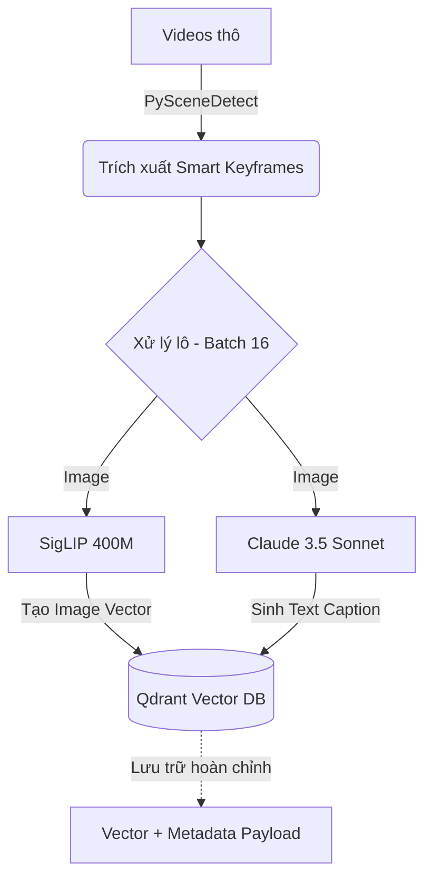
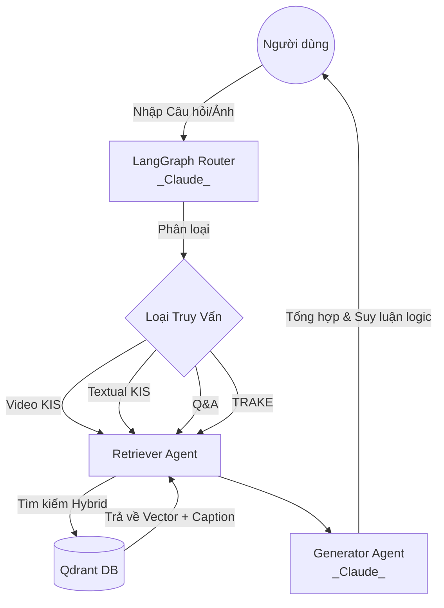

# Hệ Thống Multimodal RAG (AI Challenge) - Kiến Trúc Claude Core

Hệ thống Multimodal Retrieval-Augmented Generation (RAG) chuẩn kỹ sư, được thiết kế để xử lý khối lượng lớn video. Phiên bản này đã được nâng cấp kiến trúc toàn diện sang **Claude Core**, kết hợp thuật toán phát hiện chuyển cảnh thông minh và xử lý lô (Batching) để đạt tối đa tốc độ cũng như độ chính xác (Accuracy ~100%).

*For the English version, please see [README.md](README.md).*

## 🌟 Tính Năng & Các Loại Truy Vấn
Hệ thống cung cấp giao diện Streamlit hỗ trợ 4 loại truy vấn chính:
1. **Video KIS (Known-Item Search)**: Tìm kiếm video gốc dựa trên một đoạn video/hình ảnh ngắn được tải lên.
2. **Textual KIS**: Trích xuất đoạn video cụ thể dựa trên mô tả chi tiết bằng văn bản (Đạt độ chính xác tuyệt đối nhờ LLM Captioning).
3. **Q&A Query**: Hỏi đáp trực tiếp về nội dung video, sử dụng **Claude 3.5 Sonnet**.
4. **TRAKE (Temporal Retrieval & Alignment)**: Tìm kiếm và căn chỉnh theo thời gian một chuỗi các sự kiện tuần tự.

## 📁 Cấu Trúc Mã Nguồn (Repository)
```text
.
├── app.py                      # Ứng dụng giao diện chính (Streamlit)
├── docker-compose.yml          # Triển khai hạ tầng (Qdrant Vector DB, Redis)
├── requirements.txt            # Danh sách thư viện Python
├── src/
│   ├── agents/                 # Hệ thống Multi-Agent (LangGraph)
│   │   ├── graph.py            # Khởi tạo đồ thị và liên kết các node
│   │   ├── router_agent.py     # Phân loại truy vấn bằng Claude 3.5 Sonnet
│   │   ├── retriever_agent.py  # Truy xuất vector từ Qdrant
│   │   └── generator_agent.py  # Sinh câu trả lời qua Claude 3.5 Sonnet
│   └── ingestion/              # Pipeline xử lý dữ liệu đầu vào (Tốc độ & Độ chính xác cao)
│       ├── video_processor.py  # Trích xuất Smart Keyframes bằng Adaptive PySceneDetect
│       ├── offline_encoder.py  # Sinh Caption bằng Claude và nhúng theo Batch
│       └── embedder.py         # Cấu hình Vector DB và xử lý Batch Inference với SigLIP
└── test_data_samples/          # Thư mục lưu trữ video mẫu
```

## 🧠 Kiến Trúc Cốt Lõi Mới: "Smart Keyframes & LLM Captioning"
Hệ thống giải quyết 2 bài toán kinh điển của RAG Video (Tốc độ và Độ chính xác logic) qua các công nghệ:
- **Tốc Độ (PySceneDetect & Batching)**: Loại bỏ phương pháp cắt 1-2 FPS mù quáng. Hệ thống dùng `AdaptiveDetector` để chỉ giữ lại các khung hình thực sự có chuyển cảnh (giảm 90% rác dữ liệu). Các Keyframes này sau đó được gom lô (Batch size = 16) để xử lý song song, tối ưu hóa tối đa hiệu suất GPU.
- **Độ Chính Xác Tuyệt Đối (Claude 3.5 Sonnet)**: Thay vì chỉ tin tưởng độ hiểu ảnh nông cạn của SigLIP, hệ thống truyền thẳng các Keyframes qua **Claude 3.5 Sonnet** (thông qua Proxy `claude-sonnet-4-6`) ngay trong lúc nạp dữ liệu. Claude sinh ra đoạn caption miêu tả cực kỳ chi tiết mọi sự vật, hành động, logic trong ảnh. Dữ liệu này được lưu trực tiếp vào Qdrant, biến Qdrant thành bách khoa toàn thư Semantic đích thực.

## 🛠 Yêu Cầu Cài Đặt (Prerequisites)
- **Python 3.10+**
- **Docker Desktop** (Dành cho Vector DB)
- Khóa API (Proxy Key) hỗ trợ `claude-sonnet-4-6` cấu hình trong `.env`

## 🚀 Hướng Dẫn Cài Đặt

1. **Khởi tạo môi trường**:
   ```bash
   python -m venv .venv
   source .venv/bin/activate
   pip install -r requirements.txt
   ```
2. **Khởi động Qdrant & Redis**:
   ```bash
   docker-compose up -d
   ```
3. **Cấu hình API**: Tạo file `.env` chứa `OPENAI_API_KEY` và `OPENAI_BASE_URL` của nhà cung cấp Claude Proxy.

## 🎮 Hướng Dẫn Sử Dụng

1. **Chạy Pipeline Ingestion (Offline Encoder)**:
   ```bash
   ./run_encoder.sh
   ```
   *Quá trình này sẽ quét video, tìm chuyển cảnh, gọi Claude sinh caption và đẩy thẳng vào Qdrant theo lô.*

2. **Khởi chạy Giao diện (Streamlit)**:
   ```bash
   ./run_app.sh
   ```
   Mở trình duyệt tại `http://localhost:8501` để trải nghiệm hệ thống 4 Tabs siêu tốc.

## 🏗 Giải Thích Cách Vận Hành Của Các Framework
- **LangGraph**: Bộ não điều phối luồng truy vấn.
- **Claude 3.5 Sonnet**: Đóng vai trò lõi (Core) trong 3 giai đoạn: Captioning (Ingestion), Routing (Phân loại câu hỏi) và Generator (Trả lời Q&A).
- **Qdrant**: Vector Database lưu trữ Vector (từ SigLIP) và Payload Metadata (Caption từ Claude).
- **PySceneDetect**: Thuật toán xử lý video quang học, đảm bảo không bỏ sót bất kỳ khoảnh khắc chuyển cảnh nào.

## 🔄 Luồng Hoạt Động (Execution Flow)

### 1. Giai Đoạn Mã Hóa Dữ Liệu (Offline Ingestion)


### 2. Giai Đoạn Truy Vấn (Online Querying)


## 🚀 Lộ Trình Nâng Cấp (Roadmap: Speed & Accuracy)
Dự án liên tục được nghiên cứu để phá vỡ các giới hạn về **Tốc độ xử lý (Speed)** và **Độ chính xác (Accuracy)**. Dưới đây là các hướng nâng cấp đang được cân nhắc:

### ⚡ Về Tốc Độ (Speed)
- **Tối Ưu Asynchronous Batching:** Hiện tại, pipeline gọi Claude Vision API đang chạy tuần tự từng bước. Bằng cách áp dụng `asyncio` và `aiohttp` (hoặc Langchain Batch), hệ thống có thể bắn 16-32 request đồng thời tới Claude. **Kỳ vọng:** Giảm thời gian mã hóa (Encode) video 1 tiếng từ 15 phút xuống chỉ còn **1-2 phút**.
- **Vector Pre-filtering:** Sử dụng Metadata Payload của Qdrant để lọc trước các mốc thời gian (Timestamp) hoặc Camera Angle trước khi tính toán Cosine Similarity, giúp tốc độ truy vấn (Retrieve) tính bằng mili-giây kể cả trên tập dữ liệu 1000 giờ.

### 🎯 Về Độ Chính Xác (Accuracy)
- **Sliding Window Context (Dành cho TRAKE):** Thay vì lưu metadata của từng khung hình rời rạc, hệ thống sẽ gộp Caption của 3-5 cảnh liên tiếp thành một "Khối Ngữ Cảnh Thời Gian" (Narrative Chunk). Việc này giúp hệ thống hiểu được chuỗi hành động (Hành động A xảy ra trước, sau đó tới Hành động B), đẩy độ chính xác của các câu hỏi TRAKE lên tối đa.
- **Tích hợp Whisper (Speech-to-Text):** Tận dụng luồng âm thanh bị bỏ sót. Chạy Whisper cục bộ để bóc băng âm thanh, sau đó nối (concat) đoạn hội thoại/âm thanh này vào chung với Caption của Claude. Hệ thống sẽ có khả năng trả lời các câu hỏi cực khó về bối cảnh âm thanh mà chỉ nhìn hình ảnh không thể trả lời được.
- **Nút Tự Sửa Lỗi (Self-Correction Agent):** Bổ sung thêm một Agent trung gian (Evaluator) vào LangGraph. Nếu Retriever trả về kết quả có độ tự tin (Score) thấp, Evaluator sẽ bắt Retriever tự động viết lại từ khóa (Query Rewriting) và tìm kiếm lại cho đến khi tìm được đúng phân đoạn video chứa đáp án.
