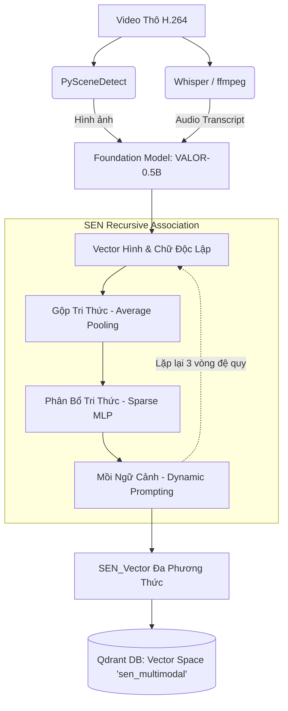

# Tài liệu Kiến trúc Tầng Mã hóa (SEN-driven Ingestion Pipeline)

Tài liệu này giải thích chi tiết pipeline và luồng xử lý dữ liệu của tầng mã hóa (Encoder Layer) sau khi tích hợp mô hình **Super Encoding Network (SEN)** vào kiến trúc RAG Đa phương thức.

Luồng hoạt động của tầng Encoder giờ đây không chỉ là "Dịch hình ảnh sang chữ" bằng LLM, mà là một vòng lặp "Giao thoa giác quan" thực thụ. Quá trình chia làm 4 giai đoạn cốt lõi:

## 1. Giai đoạn Tiền xử lý (Sensory Extraction)
Thay vì nhúng (embed) toàn bộ video, hệ thống rã video thành các thành phần nguyên thủy:
- **Thị giác:** Sử dụng `PySceneDetect` trích xuất các khung hình đại diện (Keyframes) cho mỗi Scene để giảm tải dữ liệu dư thừa.
- **Thính giác/Ngôn ngữ:** Sử dụng `ffmpeg` & `Whisper` dịch âm thanh thành lời thoại (Audio Transcript) và dùng logic Time-Alignment để gán lời thoại đó khớp với đúng khung thời gian của Keyframe.
- **Không gian (Tùy chọn):** Gọi `GLPN` để nội suy bản đồ chiều sâu (Depth map).

## 2. Giai đoạn Nhúng Nguyên thủy (Foundation Encoding)
Các khối dữ liệu thô (Hình, Chữ, Âm thanh) ở Giai đoạn 1 được đưa qua mô hình nền tảng.
> **Tối ưu HĐH Apple:** Đối với thiết bị Macbook chip M4 (16GB RAM), kiến trúc sử dụng **VALOR-0.5B** chạy trên API `mps` (Metal Performance Shaders) với `float16` thay vì ImageBind (1.1B) để ngăn chặn tràn bộ nhớ (OOM).

Mô hình VALOR sẽ mã hóa các dữ liệu này thành các Vector độc lập, nhưng tất cả cùng nằm trong một hệ quy chiếu không gian nhúng chung.

## 3. Giai đoạn Liên kết Đệ quy (SEN RA Blocks) - Trái tim hệ thống
Thay vì nối (concatenate) các vector lại một cách thô sơ, khối Recursive Association (RA) của SEN thực thi một vòng lặp (3 lần) với 3 bước giải tích:
1. **Knowledge Integrating (Gộp Tri Thức):** Các vector độc lập (Hình, Chữ) được gộp lại với nhau (dùng hàm Average Pooling) để tạo ra một "Vector Tổng" đại diện cho toàn bộ bối cảnh.
2. **Knowledge Distributing (Phân Bổ Tri Tri Thức):** Vector Tổng này được truyền qua các mạng nơ-ron nhỏ (Sparse MLP) để đẽo gọt lại thành các "Ngữ cảnh phụ trợ" (Context Vectors) tương ứng cho từng loại giác quan.
3. **Knowledge Prompting (Mồi Ngữ Cảnh):** Các Ngữ cảnh phụ trợ này được trộn ngược lại vào vector dữ liệu gốc như một dạng "Prompt ẩn", sau đó đẩy qua mô hình nền tảng để tinh chỉnh một lần nữa.

> **Hiệu quả của Đệ quy:** Sau 3 vòng lặp, Vector Hình Ảnh giờ đã mang theo nhận thức về "những gì đang được nói trong Audio", và Vector Văn Bản đã "nhìn thấy" sự biến đổi vật lý của đối tượng. Tính nhân quả thời gian (Temporal Coherence) được hình thành vững chắc mà không cần chuỗi cửa sổ trượt (Sliding Window) thủ công.

## 4. Giai đoạn Lưu trữ (Vector Upsertion)
Vector đầu ra cuối cùng (`SEN_Vector`) có độ dài 768-dim (theo VALOR) chứa trọn vẹn đặc trưng đa phương thức. 
Nó được đóng gói cùng Payload JSON (`video_id`, `timestamp`, `frame_path`, `audio_transcript`) và đẩy thẳng (upsert) vào Qdrant tại một không gian vector riêng biệt mang tên `sen_multimodal`.

---

## Sơ đồ Luồng (Pipeline Diagram)

