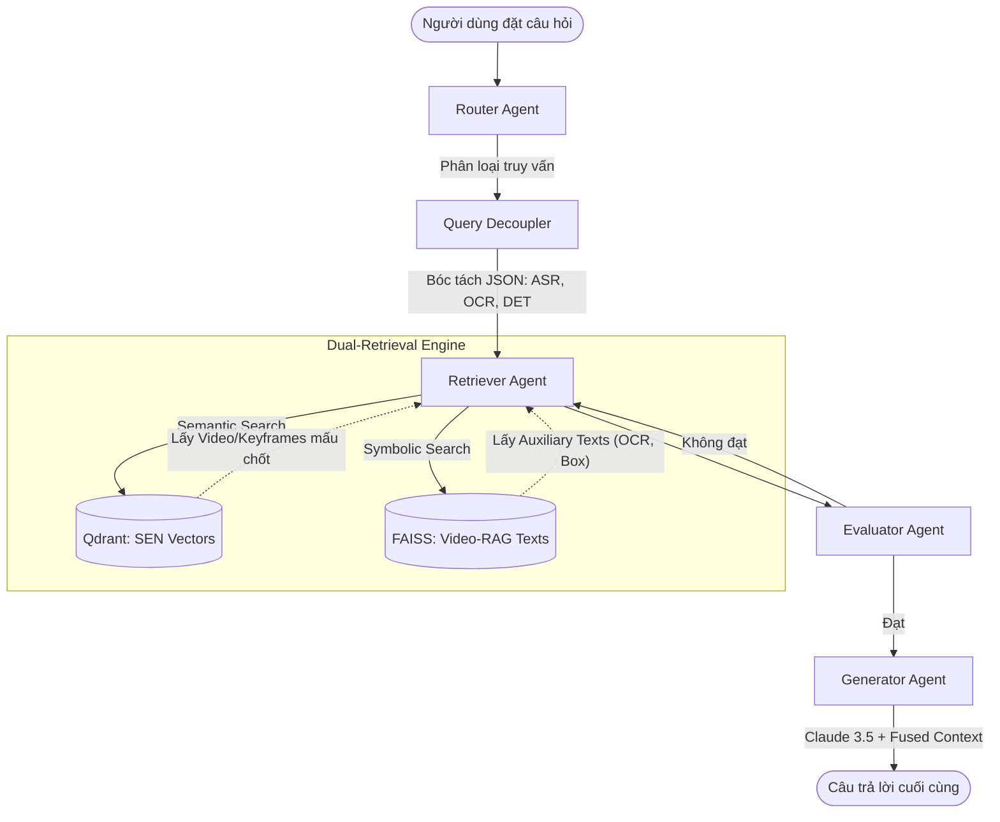

# Phân tích Luồng Pipeline RAG (Retrieval-Augmented Generation)

Tài liệu này giải thích chi tiết luồng xử lý truy vấn (Inference/Chat) của hệ thống Multimodal RAG. Hệ thống sử dụng **LangGraph** để điều phối các tác vụ, kết hợp sức mạnh trực giác của **SEN (Super Encoding Network)** và sự chính xác của **Video-RAG**.

## 1. Kiến trúc Đồ thị (LangGraph Workflow)

Luồng hoạt động của hệ thống được chia làm 5 Agent (Node) hoạt động tuần tự:

## 2. Chi tiết Từng Giai đoạn (Node)

### 2.1. Router Agent (Người Điều Hướng)
- **Đầu vào:** Câu hỏi của người dùng (và hình ảnh đính kèm nếu có).
- **Nhiệm vụ:** Claude sẽ phân loại câu hỏi vào một trong các nhánh:
  - `VIDEO_KIS`: Tìm video từ một bức ảnh đầu vào.
  - `TEXTUAL_KIS`: Tìm video từ đoạn mô tả văn bản.
  - `QA`: Hỏi đáp chi tiết về một mốc thời gian / sự kiện ngắn.
  - `TRAKE`: Hỏi đáp suy luận diễn biến dài hạn (ví dụ: Tóm tắt hành động của nhân vật chính).

### 2.2. Query Decoupler (Bộ Bóc Tách Truy Vấn - Video-RAG)
- **Nhiệm vụ:** Đây là "bộ lọc tư duy" trước khi đi tìm kiếm. Nó phân tích xem câu hỏi có cần dữ liệu chi tiết (đếm số, đọc chữ) hay không.
- **Đầu ra:** Nó biến câu hỏi *"Có bao nhiêu người đứng trước chiếc xe biển số 29A?"* thành một cấu trúc JSON:
  - `"OCR"`: "biển số 29A"
  - `"DET"`: ["người", "xe"]
  - `"TYPE"`: ["number", "location"]

### 2.3. Retriever Agent (Bộ Truy Xuất Kép)
Đây là trái tim của hệ thống RAG, thực hiện 2 mũi nhọn tìm kiếm song song:
1. **Mũi nhọn Trực giác (SEN - Dense Retrieval):** Ném câu hỏi vào không gian vector của Qdrant (VALOR-0.5B / BGE-M3) để tìm ra **Keyframes và Đoạn Video** có ngữ nghĩa khớp nhất.
2. **Mũi nhọn Lý trí (Video-RAG - Symbolic Retrieval):** Cầm ID của video vừa tìm được + JSON từ Decoupler để quét trong FAISS, lấy ra các **Auxiliary Texts** (Văn bản phụ trợ như: "Obj counting: 3 người", "OCR text: 29A-123.45").

### 2.4. Evaluator Agent (Bộ Thẩm Định)
- **Nhiệm vụ:** Kiểm tra xem dữ liệu tìm được (Hình ảnh + Văn bản) đã đủ để trả lời câu hỏi chưa. Nếu dữ liệu rác hoặc không liên quan, nó sẽ ra lệnh cho Retriever tìm lại (vòng lặp) hoặc đổi chiến thuật.

### 2.5. Generator Agent (Bộ Sinh Câu Trả Lời)
- **Nhiệm vụ:** Gọi Claude 3.5 Sonnet (hoặc Claude 4-6).
- **Prompt hợp nhất (Fused Context):** Claude sẽ được cung cấp ĐỒNG THỜI:
  1. Câu hỏi gốc.
  2. Các hình ảnh (Base64) của Keyframes.
  3. Lời thoại (Audio Transcript) của đoạn đó.
  4. Văn bản phụ trợ (OCR, DET) từ Video-RAG.
- **Kết quả:** Claude dung hợp tất cả, lấy OCR/DET làm "kính lúp" để khắc phục điểm mù của hình ảnh, từ đó đưa ra câu trả lời tiếng Việt chính xác, không bị ảo giác (hallucination).
